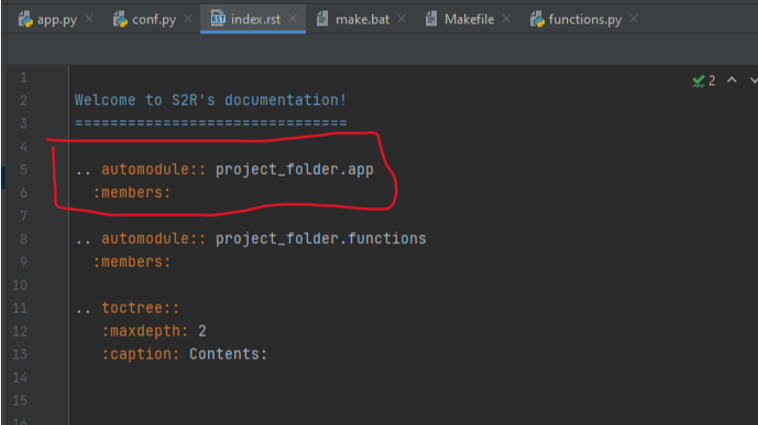

# Sphinx Auto Docs Template
A template project to be used for doc generation without cluttering source project with unnecessary packages.

## How to use

- Clone from repository
- Delete app.py and functions.py
- Copy files from source project to:

```sphinx_template > project_folder```

- Open the index.rst file within docs
- for each new py file add:



  

^ Remember to delete project_folder.functions

- In terminal (if not already there):

```
cd docs

make latex
```

- Open TeXworks 
- Navigate to docs folder, latex then open the .tex file
- Run